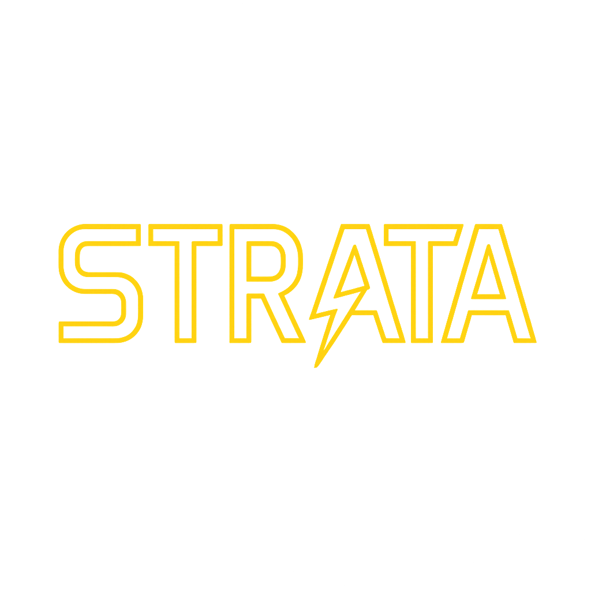

**Strata** is a **next‑generation, streaming‑first distributed datastore**.  
It combines the **speed of in‑memory systems** with the **durability of Pebble (LSM engine)**,  
and exposes **Redis‑like primitives** over **gRPC** (RESP support coming soon).  

Strata is designed to be:
- **Blazingly fast** ⚡
- **Streaming‑first** (every change can be consumed in real‑time)
- **Developer‑friendly** (clean APIs, CLI, observability)
- **Production‑ready** (persistence, replication, sharding)

---

## 🚀 Features

### ✅ Done
- **Core Engine**
  - Pluggable `StorageEngine` interface
  - Pebble engine implementation (persistent, LSM‑tree)
- **Server**
  - gRPC server with clean layered architecture
  - CLI client for testing
- **Primitives**
  - **Strings** → `Set`, `Get`, `Del`
  - **Lists** → `LPUSH`, `RPUSH`, `LPOP`, `RPOP`
  - **Documents** → `DocSet`, `DocGet`, `DocDel` (with full JSONPath support)
- **Dev Tools**
  - Makefile (`make proto`, `make run`)
  - Pebble store inspection via `pebble db scan ./data`

### 🚧 Coming Soon
- **Strings**
  - `SETEX` (TTL support) ⏳
- **Sorted Sets**
  - `ZADD`, `ZRANGE`
- **Streaming**
  - System event stream (all mutations emit events)
  - gRPC streaming API
- **Cluster**
  - Sharding (slot‑based, CRC16)
  - Replication (Raft)
- **Persistence**
  - AOF + Snapshots
- **Advanced**
  - Multi‑region replication
  - Observability (metrics, tracing, dashboards)
  - Admin UI + SDKs

---

## 🏗 Architecture


- **Server Layer** → routes requests (gRPC/RESP)  
- **Primitives Layer** → implements Redis‑like commands  
- **Engine Layer** → raw KV (Pebble)  

---

## ⚡ Usage Rules

Strata is **not a toy** — it’s a datastore. Follow these rules:

1. **Always go through the server**  
   - Don’t talk to Pebble directly.  
   - Use gRPC or CLI client.  

2. **Primitives only**  
   - Strings → `Set`, `Get`, `Del`  
   - Lists → `LPUSH`, `RPUSH`, `LPOP`, `RPOP`  
   - Documents → `DocSet`, `DocGet`, `DocDel` (with JSONPath)  
   - Sorted Sets → `ZADD`, `ZRANGE` (coming soon)  

3. **Keys are global**  
   - Use namespaces (`user:123`, `chat:room1`) to avoid collisions.  

4. **TTL (coming soon)**  
   - Expired keys will be lazily deleted on access.  
   - Don’t rely on them for precise scheduling.  

5. **No placeholders**  
   - Every feature is real, backed by Pebble.  

---

## 🛠 Quick Start

### Build & Run
```bash
make proto
make run
```

---

## ⚡ Vision

Strata is not just another KV store.  
It’s a **streaming‑first datastore** where every mutation is an event,  
and developers can build **real‑time, distributed systems** on top of it.  
